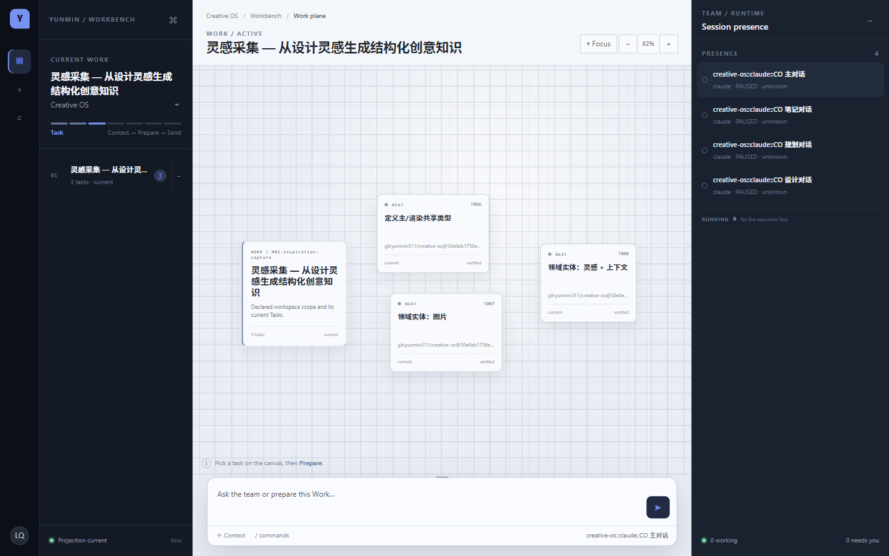
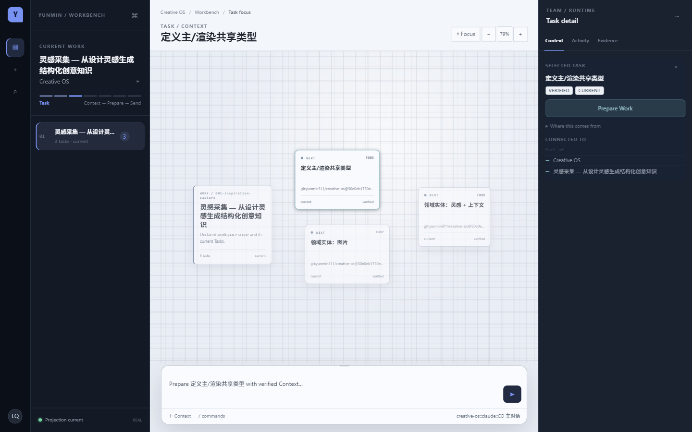
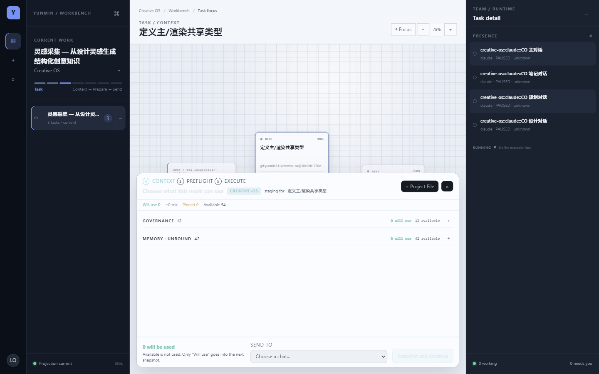
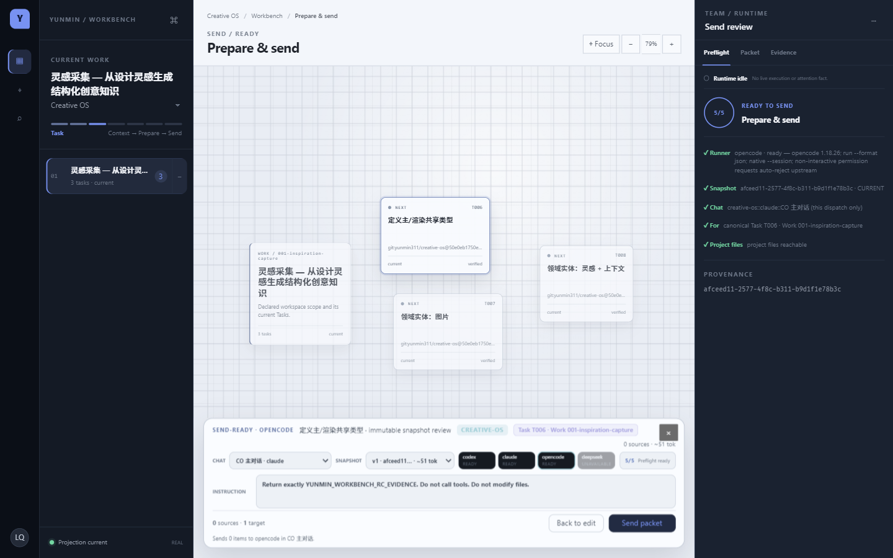
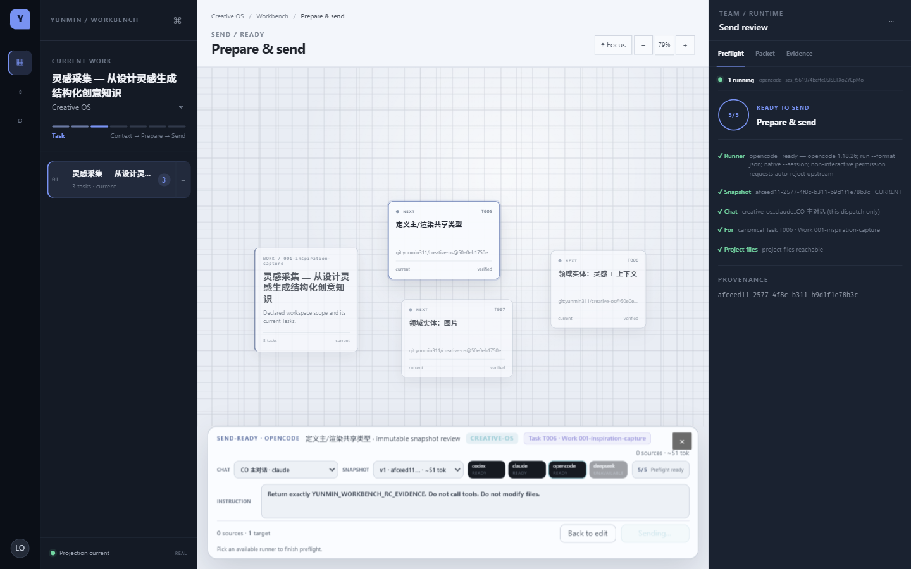
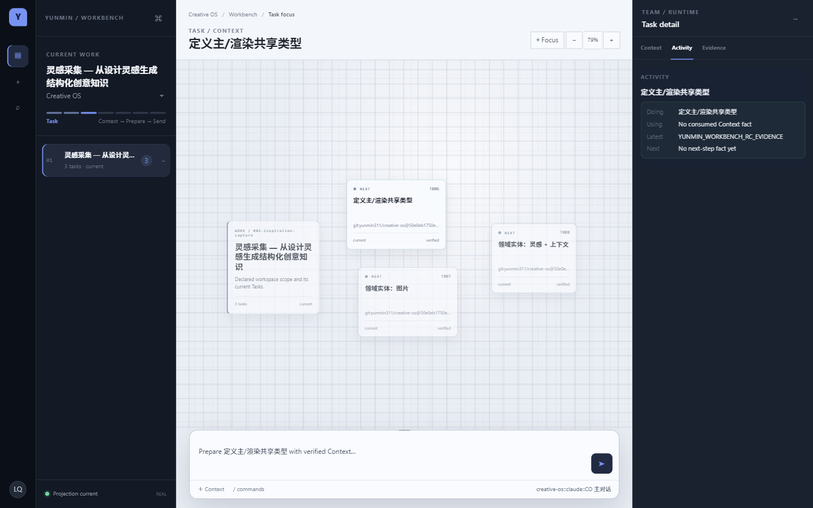
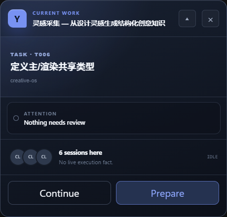

# Yunmin Workbench

Yunmin Workbench 是一个面向 Agent 工作流的桌面工作台。它把项目里的 canonical Work / Task、治理侧 Context、Harness session 与真实执行事件投影成一条连续路径：

`Project → Work → Task → Context → Prepare → Send → Running → Result`

它不是 Task 数据库，也不是新的治理 Source of Truth，更不是 Claude Code、Codex 或 OpenCode 的替代品。

> **Workbench is a verified projection, not a second SOT.** 事实仍属于项目、Git、Governance / Overlay 和 Harness；Workbench 只保存自己的窗口、staging、packet、activity 与交互书签。



## 产品路径

1. **Project / Work / Task** — 读取项目声明的真实 facts；Canvas 默认保持低密度，Task 多于三个时可 spatial drill-in，全部真实 Task 都可达。
2. **Context** — Context Cabinet 区分 Available 与 Will use；只有本次真正需要的内容进入 snapshot，显式 pinned / override 优先。
3. **Prepare / Send** — 选择 conversation、冻结 packet、检查 runner / snapshot / lineage，再发送给可用 Harness。
4. **Running / Attention** — Full、Send-ready 与 Compact 消费同一份 authoritative runtime projection；失败摘要与 provenance 留在 Activity / Attention。
5. **Result** — Task 主视图突出最新有效 response，完整 chronology 保留在 progressive disclosure 中。







## 真实执行

下面两张图来自当前 production Electron，经 `Prepare → Send` 发往 OpenCode 的真实免费模型调用。执行使用 provider-owned native `ses_*` identity；prompt 禁止 tools 和文件修改，验证后项目 Git working tree 仍为空。





Compact 是同一产品状态的独立 Edge Surface，不是 Full 的缩小截图：它保留 Current Work、Attention、Runtime / Session Presence 与 Next Action。



## Harness capability truth

能力在运行时由本机 CLI / protocol probe 决定；未安装或协议不匹配时会诚实降级。

| Harness | Dispatch | Runtime / receipt | Native session | Exact resume | 当前限制 |
|---|---:|---:|---:|---:|---|
| OpenCode | YES | YES | YES | YES | `opencode run --format json` 与精确 `--session ses_*` 已做 REAL E2E；approval / user-input、外部 OpenCode 进程观察与 file events 尚不支持 |
| Codex | YES | YES | YES | NO | 官方 app-server `thread/start` / `turn/start` 已做 REAL dogfood；不把已有 thread 猜成可 resume |
| Claude Code | YES | YES | protocol 提供时记录 | NO | 使用 `stream-json`；approval / needs-input 不在当前稳定 contract 内，file events 为 UNKNOWN |
| DeepSeek / DSH | NO | NO | UNKNOWN | NO | 可探测本机 headless capability，但没有可信 structured lifecycle 与 native session seam，因此不 dispatch |

## 本地运行

要求：Windows 为主要验证平台，Node `>=22.13`，pnpm 固定为 `11.7.0`。

```powershell
corepack enable
corepack pnpm install --frozen-lockfile
$env:GOV_OVERLAY = 'E:\path\to\your\overlay'
pnpm dev
```

常用验证：

```powershell
pnpm typecheck
pnpm test
pnpm build
pnpm e2e:hermetic
```

项目目录不会靠 cwd、标题或时间猜测。首次换机器或项目移动后，通过产品内的 folder / rebind 流程验证 canonical identity。

## Windows packaged build

```powershell
pnpm package:win
```

输出为 `release/Yunmin-Workbench-0.1.0-x64-Setup.exe`（NSIS x64 installer）以及 `release/win-unpacked/`。当前没有代码签名证书，因此这些产物是 **unsigned RC artifacts**；Windows 会显示未知发布者提示。仓库不会自动发布 GitHub Release。

安装器使用稳定 app id `com.yunmin.workbench`，升级沿用同一安装 identity。卸载器不删除 `%APPDATA%\yunmin-workbench`；重新安装后 Workbench-owned state 仍在。开发运行与 packaged app 当前使用同一默认 user-data identity；测试或隔离运行应显式设置 `WB_STATE_DIR`。

## 数据与升级边界

- **User-owned:** 项目文件、Git、Governance / Overlay、Harness history。Workbench 的 discovery / projection 不自动覆盖它们；Agent 真正执行时产生的项目修改仍需正常 Git review。
- **Workbench-owned:** `%APPDATA%\yunmin-workbench\state` 下的窗口 / Compact geometry、Context staging、draft、frozen packet、Activity、Memory use 与本地 bindings。
- 状态文件带 schema version，关键写入使用同目录 temp + rename。未来 schema 不会被旧版本静默覆盖；损坏的当前本地 binding / attention 文件会保留为 `.rejected-*` 后恢复到可重新绑定的安全空态。
- Activity 是 history / evidence，不是第二套 Running truth；LiveExecutionRegistry 是 Workbench-owned live runtime 的唯一 writer。
- `available != used`、`UNKNOWN` 不猜、REAL / TEST 严格分离。正常产品启动不会进入 fixture scene。

## 当前限制

- Windows installer 未签名，也没有 auto-update channel；升级需运行新的 installer。
- 没有项目级开源许可证文件；公开展示不等同于授予再分发许可。第三方来源与许可证见 [THIRD_PARTY_NOTICES.md](THIRD_PARTY_NOTICES.md)。
- OpenCode 的 approval / user-input、外部进程实时观察、file events 与完整 history projection 尚未实现。
- Claude / Codex 的 resume 只有经过 provider-owned exact seam 验证后才会开放；当前不会 fuzzy match。
- DeepSeek 保持只探测、不可 dispatch，直到存在可信 structured protocol。

## Repository verification

GitHub Actions 独立执行：

- TypeScript typecheck、Vitest、production build、README 本地链接 / 图片校验；
- Linux + `xvfb-run` 的 portable hermetic Electron E2E；
- Windows x64 unsigned NSIS package 与 packaged Electron smoke。

设计恢复历史与 approved baseline 保存在 [`docs/design-recovery/`](docs/design-recovery/)，但 README 中的产品截图全部来自当前 production Electron。
