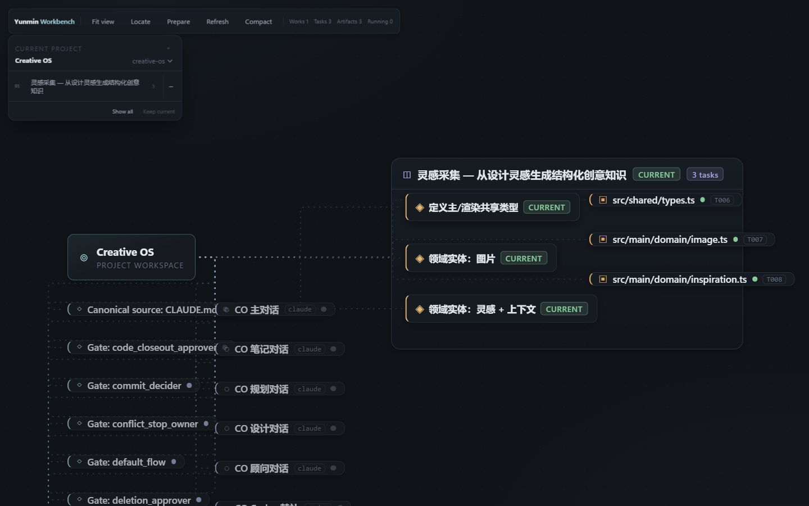
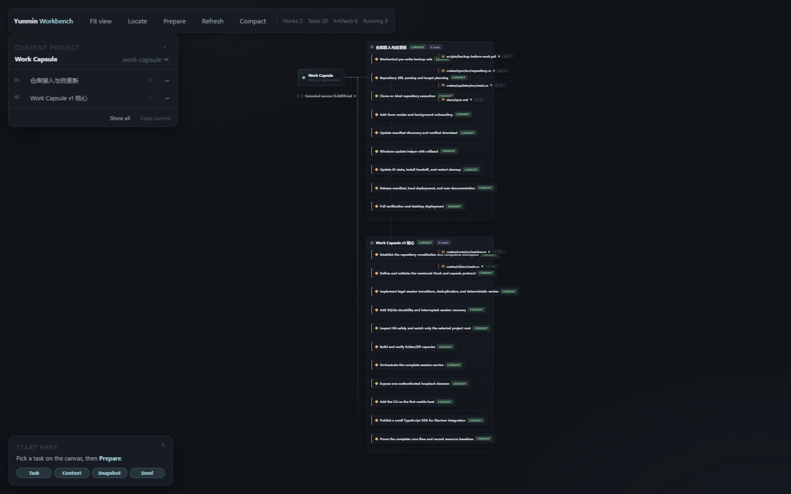
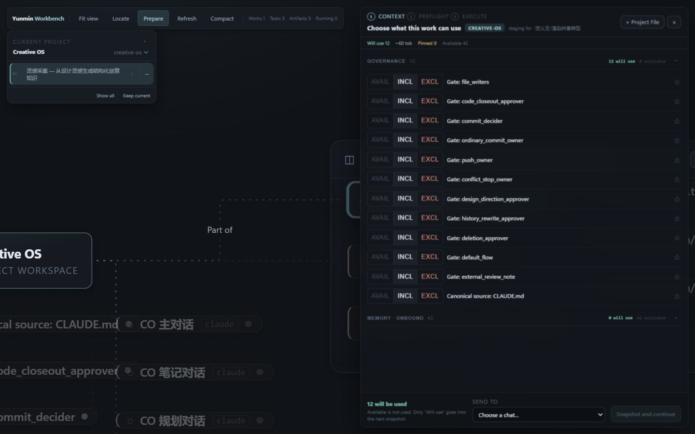
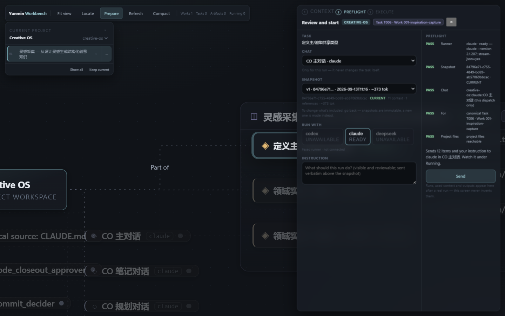
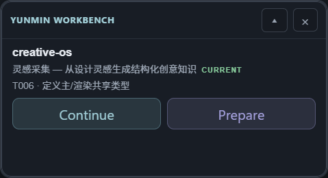

# Yunmin Workbench

个人 Agent 工作台：把 Governance、项目、Git、Harness 之上的事实投影成一张可工作的画布。它不替代 Claude Code / Codex / DeepSeek，也不复制任何外部 Source of Truth——只负责让你看清工作在哪、带什么上下文、发给谁做。



**Full Workbench** 是主工作面：Project → Work → Task → Context → Prepare → Send，一条走到底。**Compact** 是常驻小窗：当前工作随身带，一键回到原文，一键开始准备。

## 现在能做什么

- 打开即进入 vNext 主界面；没有数据时是 Welcome + Choose folder，不是空白报错
- 在 Canvas 上选 Task，看清它属于哪个 Work、连着什么
- 在 Context Cabinet 里决定这次带什么上下文（Will use / Available，稀疏持久化，只记你的显式决定）
- 选一个 chat 做 Snapshot，到 Dispatch 检查通过后 Send
- Compact 小窗随时 Continue / Prepare，全程同一份事实往返

```
Project → Work → Task → Context → Prepare → Send → Running
```









更多状态截图（Welcome、Task focus、Context detail、Prepare、窄窗口等）都在 [`docs/images/workbench/`](docs/images/workbench/)。

## 数据原则

- REAL 数据（Governance adapter、项目 canonical facts、真实运行时事件）与 TEST 数据严格分离；TEST FIXTURE 只能显式进入，不会出现在正常产品里
- 没有事实就不编：缺失状态保持 UNKNOWN，不猜、不补故事
- Workbench 是投影层：排序、拖动、staging 只影响本地视图，不反写 Governance、项目或 Git

## 本地启动

需要 Node `>= 22.13`，pnpm 由 `packageManager` 固定（`pnpm@11.7.0`，走 corepack）：

```bash
corepack enable
corepack pnpm install --frozen-lockfile
pnpm dev        # 开发运行
pnpm build      # 构建
pnpm start      # 预览构建产物
pnpm typecheck  # 类型检查
pnpm test       # 单元测试
pnpm e2e        # 先 build，再跑 Playwright Electron 关键路径
```

用自己的数据启动：设置 `GOV_OVERLAY` 指向你的 Personal Overlay 根目录。没有可用 GPU 的环境（headless CI、远程会话）加 `WB_ELECTRON_ARGS="--no-sandbox --disable-gpu"`。

## 当前状态与已知限制

- 目前还没有 REAL Execution：没有真实 dispatch 产生过运行时事件，所以 Running 诚实地为 0（不会用 fixture 充数）
- work-capsule 项目尚未绑定 conversation，它的 Prepare 会明确告诉你缺什么，而不是假装能继续
- 旧版 prototype 界面仍保留为显式回退（`WB_RENDERER_LEGACY=1`），默认不再使用

---

以下为开发与数据契约备忘（产品行为以 UI 为准）。

## 稳定数据流

```
Governance Kernel + Personal Overlay / Profile + Project / Git / Harness
  → Adapter / Normalize → Workbench Projection → Interaction
```

数据库、缓存、Canvas、Timeline、History index 永远只是 projection/cache。UI 排序、Canvas 拖动、Context 操作不反写 Governance、Project 或 Git。

## 正本在哪

| 问题 | 权威来源 |
|---|---|
| 当前事实（代码 / 测试 / Runtime / 依赖） | Git、实际文件、测试、Harness Runtime |
| 执行基准 | `doc/` · *E LONG-TERM BASELINE — FROZEN v2* |
| Reuse / donor / license 决策 | `doc/` · *REUSE-MAP FINAL v2* |
| 产品意图与边界（历史合同） | `doc/` · *Yunmin Workbench 项目完整描述* |
| 已核验的第三方溯源与许可证 | `THIRD_PARTY_NOTICES.md` |

`doc/` 是文档与交接资料入口，**不是 Source of Truth**。基准文档里的 SHA、测试数字与依赖都是快照，不能反过来覆盖真实外部事实。

## Projection Integrity（domain 级约束）

1. **Observation Contract**：投影实体带 `observed = { source, sourceRef, observedAt, verification }`；heuristic 永不与 canonical/protocol 同级；无模型 confidence。
2. **Execution Binding**：Binding 属于一次 Runtime Session/Execution，不永久绑 Conversation；只从各 Harness 原生 session ref 写入，不以 cwd/provider/time 猜 identity。
3. **State Separation**：`TaskState` / `RuntimeState` / `AttentionState` 永久分开；不生成假 Task、不做 Task Board。
4. **Frozen Packet Validity**：依赖全部可核验且一致 → CURRENT；fingerprint 改变 → STALE；来源消失 → INVALID。Frozen body 不可变，变化只产生新版本。
5. **Intent/Receipt**：`DRAFT → DISPATCHED → ACCEPTED|REJECTED|FAILED|CANCELLED`；Dispatch receipt 不等于 Task completion。
6. **Context staging 是稀疏覆盖**：只持久化你的显式决定；恢复默认值即删除覆盖，未动过的项永远跟随 source 默认。

## Runtime adapter 当前能力

| Harness | Dispatch | Observe | Receipt |
|---|---|---|---|
| Codex | YES | YES | YES |
| Claude | YES | YES | YES |
| DeepSeek | **NO** | **NO** | **NO** |

DeepSeek 当前没有经验证的稳定 structured runtime，明确降级，不做 heuristic live。

## 外部事实 env seam

| 变量 | 作用 |
|---|---|
| `GOV_OVERLAY` | 指定 Personal Overlay 根目录（生产发现路径的正式 seam） |
| `WB_OVERLAY_SEARCH_ROOT` | 覆盖 Overlay 扫描根目录 |
| `WB_STATE_DIR` | 把 Workbench 自有状态重定向到临时目录（E2E 用） |
| `WB_CLAUDE_HISTORY_ROOT` / `WB_CODEX_HISTORY_ROOT` / `WB_CODEX_ARCHIVED_HISTORY_ROOT` | 覆盖只读历史根目录 |
| `WB_ELECTRON_ARGS` | 额外的 Electron 启动开关（见上） |
| `WB_RENDERER_LEGACY` | `=1` 时回退旧版界面（rollback/debug 用，默认 vNext） |

## 架构边界速览

- `src/core`：纯函数零 IO（parse / Staging / Packet / Activity / attention / history / memory）；Canvas 区分 membership 结构关系与 execution 真实流
- `src/main/adapters`：只读 Overlay、Git、项目文件、Harness 协议；`src/main`：IPC + Workbench 自有状态（Frozen Packet / Draft / Staging / Activity / Window / Attention / Portability）
- `src/renderer-vnext`：默认产品界面；`src/renderer-compact`：小窗；`src/renderer`：旧版回退
- R0 可靠性（不可回退）：Frozen store per-file 校验与 corruption isolation、atomic 写、Activity JSONL 确定性隔离、IPC 分页、single instance。
